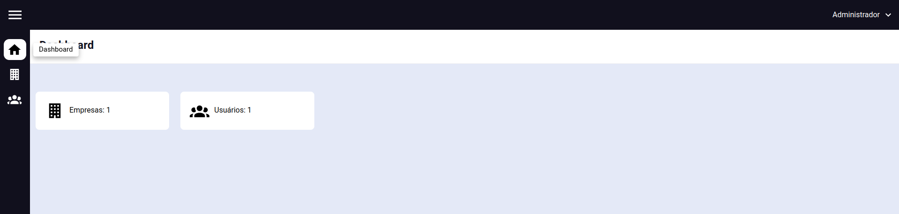
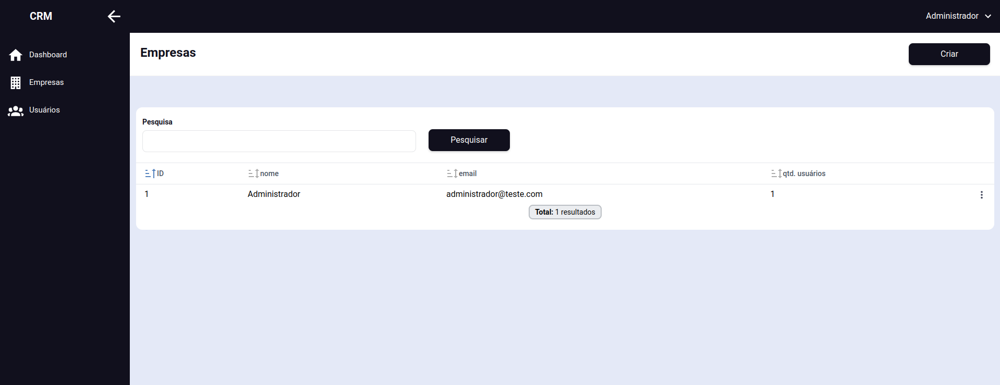
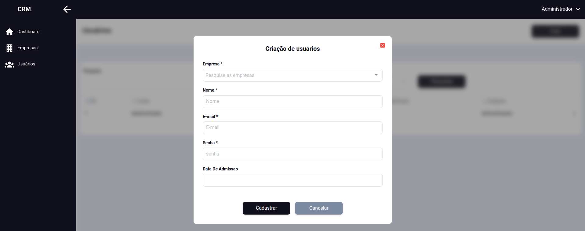

# Aplicação de exemplo com Laravel, Vue e Inertia

Aplicação com 2 CRUDs, um de empresa e outro de usuários, com o objetivo
de exemplificar:

- Login
- Crud completo
- Listas com pesquisa, ordenação e paginação


## Credenciais

**email:** administrador@teste.com

**senha:** 123456

## Configurar o .env

- Configurar o .env com as credenciais de banco

## Executar o projeto

```shell
npm install

composer install


#cria tabelas e dados automaticamente
php artisan migrate:fresh --seed

#mantem a interface sendo buildada
npm run dev
```


## Build de produção

```shell
npm run build
```


## Imagens






